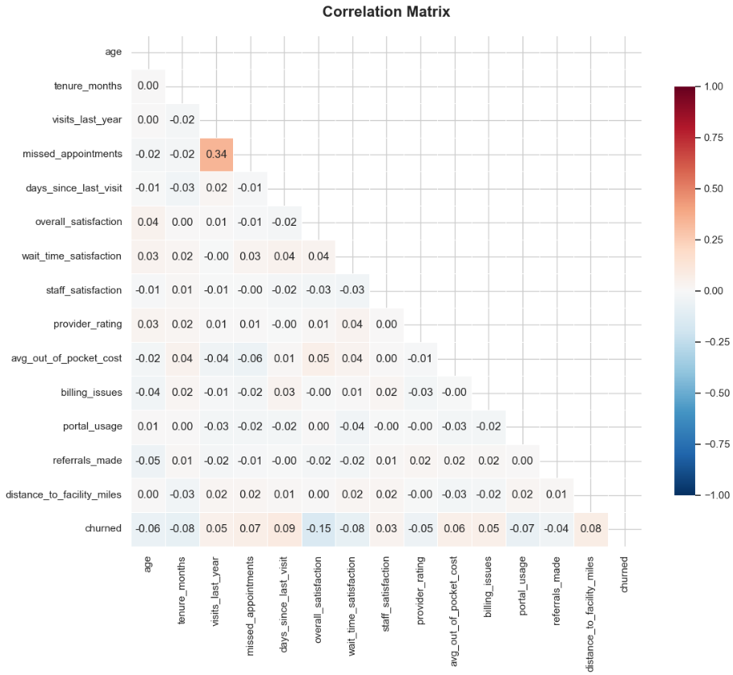
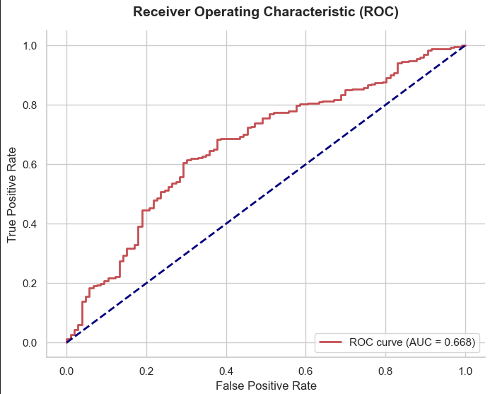
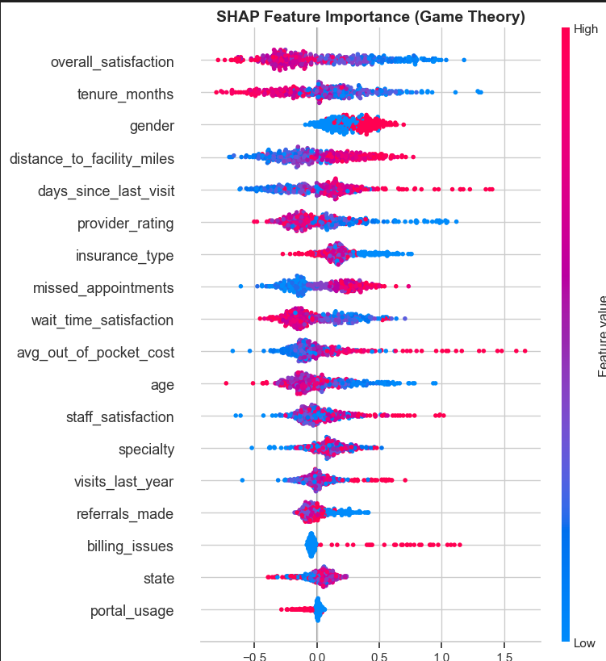

# Patient Churn Prediction Using Explainable AI (XAI)

## Project Overview
This project deploys a machine learning pipeline using **LightGBM** and **SMOTE** to predict patient churn. To move past "black-box" predictions, it integrates **SHAP (SHapley Additive exPlanations)** to provide interpretable, game-theory-backed feature insights for healthcare administrators.

---

## Data & Modeling Pipeline
* **Class Imbalance:** Resolved severe churn label skew using Synthetic Minority Over-sampling Technique (**SMOTE**) on the training set.
* **Feature Scaling:** Applied `StandardScaler` to continuous features (`tenure_months`, `avg_out_of_pocket_cost`) to prevent feature dominance.
* **Model:** Utilized **LightGBM** (Light Gradient Boosting Machine) for its speed and ability to capture non-linear patient behavioral patterns.

---

## Model Evaluation

### Diagnostics & Discriminatory Power
* **Primary Metric:** Area Under the ROC Curve (**ROC-AUC**).
* **Operational Accuracy:** 68% (Prioritizes minority class recall over misleading global accuracy to ensure high-risk patients are flagged).

#### Confusion Matrix
Balances precision and recall, minimizing dangerous false negatives.


#### ROC-AUC Trajectory
Demonstrates the model's performance and classification thresholds.


---

## Explainable AI (XAI) Insights
Instead of generic importance metrics, SHAP values show the direction and magnitude of how each patient feature drives or prevents churn.



### Core Discoveries
* **The Attrition Trigger (`overall_satisfaction`):** Volatile swing factor; low satisfaction is the strongest driver pushing patients toward defection.
* **The Operational Friction (`billing_issues`):** Clear directionality; presence of billing disputes consistently forces the model to predict churn.
* **The Financial Burden (`avg_out_of_pocket_cost`):** High out-of-pocket costs form a major cluster on the high-risk churn side.
* **The Inertia Variable (`portal_usage`):** Tight clustering near zero indicates digital engagement has negligible impact compared to cost and clinical satisfaction.

---

## File Structure
```text
├── data/
│   └── dataset.csv                 # Patient cohort data
├── images/
│   ├── confusion_matrix.png        # Evaluated matrix plot
│   ├── roc_curve.png               # ROC-AUC curve plot
│   └── shap_summary.png            # SHAP beeswarm plot
├── patient_churn_pipeline.ipynb    # End-to-end notebook
└── README.md                       # Project documentation
